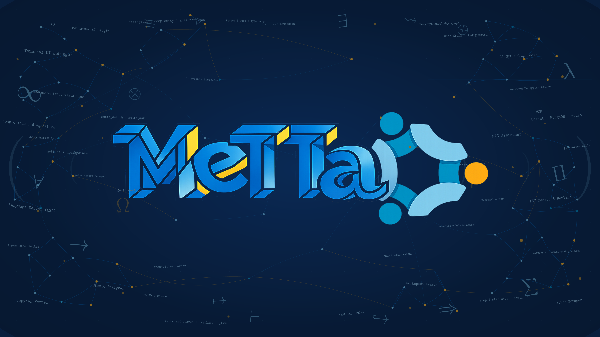

  
  &nbsp;&nbsp;
  
  &nbsp;&nbsp;
  
  &nbsp;&nbsp;
  
  &nbsp;&nbsp;
  
  &nbsp;&nbsp;
  
  &nbsp;&nbsp;
  
  &nbsp;&nbsp;
  
  &nbsp;&nbsp;
  

  I'm a UNSW student who's passionate for the development of neurosymbolic AI in all areas, such as knowledge representation and reasoning, natural language processing, automated theorem provers, and more :)) I'm currently focusing on the MeTTa ecosystem, but 
  
  I'm open and seeking work

